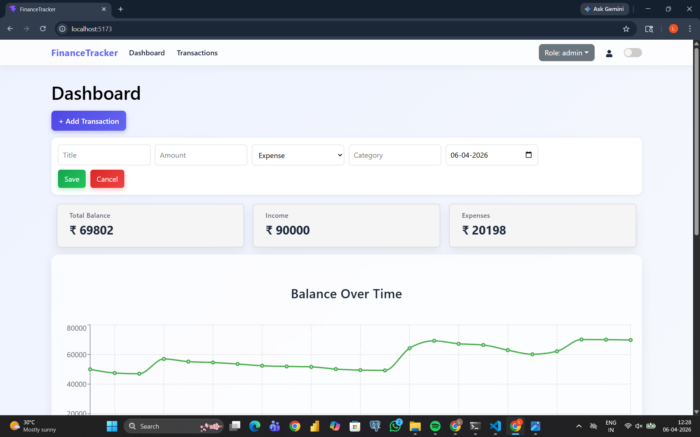

#  Finance Tracker Dashboard

A modern financial tracking dashboard built using React that allows users to manage transactions, visualize spending patterns, and gain insights into their financial activity.

---

##  Tech Stack

*  React (Vite)
*  React Bootstrap + Bootstrap 5
*  Recharts (Data Visualization)
*  React Icons
*  React Router DOM
*  Context API (State Management)
*  LocalStorage (Data Persistence)

---

##  Project Overview

This project is designed to help users track their financial activities in a simple and intuitive way.

Users can:

* Monitor their total balance
* Analyze income and expenses
* Visualize financial data using charts
* Manage transactions efficiently

The application focuses on **clean UI, real-time updates, and persistent data storage without a backend**.

---

##  Approach & Design Decisions

### 1. State Management

* Used **Context API** to manage global transaction data
* Avoided prop drilling for cleaner component structure

### 2. Data Persistence

* Implemented **LocalStorage**
* Ensures data remains even after page refresh

### 3. Component-Based Architecture

* Divided UI into reusable components:

  * Dashboard
  * Charts
  * Navbar
  * Transactions
  * Summary Cards

### 4. Role-Based Access

* Implemented simple role logic:

  * **Admin** → Full access (Add/Edit/Delete)
  * **User** → View-only
* Helps simulate real-world application behavior

### 5. Data Visualization

* Used **Recharts** for:

  * Expense distribution (Pie Chart)
  * Balance trends (Line Chart)

---

##  Features (Detailed)

###  Dashboard

* Displays:

  * Total Balance
  * Total Income
  * Total Expenses
* Quick overview using summary cards

---

###  Charts & Insights

* **Line Chart**

  * Shows balance trend over time
* **Pie Chart**

  * Displays category-wise expense breakdown

---

###  Transactions Management

* Add new transactions
* Edit existing transactions
* Delete transactions
* Each transaction includes:

  * Amount
  * Category
  * Type (Income/Expense)

---

###  Search & Filters

* Search transactions dynamically
* Filter by:

  * Type (Income / Expense)
  * Category

---

###  Role-Based UI

* Admin can:

  * Add, edit, delete transactions
* User can:

  * Only view data

---

###  Theme Toggle

* Light/Dark mode support
* Improves user experience

---

###  LocalStorage Integration

* Automatically saves data in browser
* No backend required

---

##  Installation & Setup

1. Clone the repository:

```bash id="8jmxzc"
git clone https://github.com/your-username/finance-tracker.git
```

2. Navigate to the project folder:

```bash id="6b82b6"
cd finance-tracker
```

3. Install dependencies:

```bash id="3y0r9s"
npm install
```

4. Start development server:

```bash id="32lwdc"
npm run dev
```


---

## 📸 Screenshots

## 📸 Screenshots

<h3> Dashboard (Light Mode)</h3>



<br/>

<h3> Transactions (Light Mode)</h3>


<br/>

<h3> Dashboard (Dark Mode)</h3>


<br/>

<h3> Transactions (Dark Mode)</h3>


---

##  Author

**Lakshit Poojari**

 Mumbai, India

